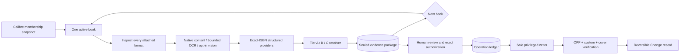
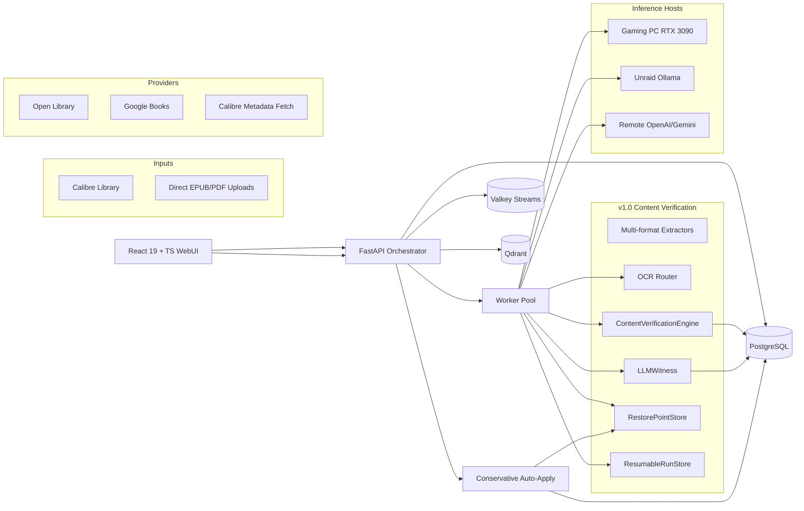

# Architecture

The development head of `calibre-ai-auditor` is the Manifestation V2
exact-edition auditor. It treats each original ebook format as read-only
evidence, resolves identity before proposing metadata, and seals the complete
decision record. The historical v1.0 engine remains documented below.

This document is the canonical overview. Detailed component breakdowns
live in `docs/architecture/`.

The accepted product boundary is a local, supervised Calibre metadata auditor,
not a general library-management platform or unattended writer. See
[ADR-003](docs/decisions/ADR-003-supervised-local-auditor-scope.md).

## Open-Source Inspirations

| Project | Inspiration |
|---|---|
| **Calibre** | Authoritative ebook metadata format (OPF), file-format operations, cover extraction |
| **Calibre-Web-Automated** | Ingest watchers, provider hierarchy, duplicate handling, automated backups |
| **paperless-ngx** | Ingest queue, document review workflow, API design, bulk actions, admin UX |
| **paperless-gpt** | Multi-provider LLM orchestration, OCR fallbacks, background jobs, manual review checkpoints |
| **Apache Tika** | Optional deterministic extraction sidecar for robust document parsing |
| **Qdrant** | Vector embedding storage for semantic duplicate detection |
| **PostgreSQL** | Production transactional system-of-record |
| **Valkey** | Job queues, distributed task state, rate-limit caching |
| **Komf / Komga / Kavita** | Metadata matching logic, reader interfaces, library review patterns |
| **book-memex** | URI-addressable book records, FTS5 search, MCP-style agent integration patterns |

`Readarr` is considered retired; `paperless-ai` is a workflow-idea source
only. `paperless-gpt` is the most direct workflow inspiration.

---

## Manifestation V2 (default verification path)

The CLI and `POST /api/verify` now default to the `manifestation-v2` contract.
The v1.0 architecture below remains available with `--pipeline v1`, but it is
not the default identity or V2 write contract.

Important boundaries:

- The Calibre record is the value being audited, never an identity root.
- The original ebook files are hashed and read only. Parsers, converters, OCR,
  and vision consume stable no-follow temporary copies; paths must remain inside
  the configured library.
- A single OCR result, vision output, or LLM response can seed review and exact
  lookup but cannot promote Tier A. Two OCR engines form one content root.
- External adapters accept only an exact checksum-valid ISBN returned in the
  provider's structured record. Network calls are HTTPS/host/DNS/schema/size
  constrained and reject redirects.
- V2 packages are persisted in `EvidencePackage.observations` with
  `schema_version=2`; `decision` stays null so legacy V1 apply cannot consume
  them accidentally.
- The V2 public apply path always requires authorization bound to the package
  checksum and canonical patch. The writer verifies exact sealed paths before
  mutation. If Calibre relocates a book directory during the write, post-write
  verification requires unique paths beneath the same root and the identical
  format/SHA-256 multiset before aligning only Calibre-managed path fields.
  Automatic V2 apply and all public legacy apply paths are disabled;
  calibration output is advisory only.

See [ADR-002](docs/decisions/ADR-002-exact-manifestation-v2.md) for the tier,
provenance, privacy, and rollback invariants.

### Read-only Content Server source

`ContentServerSource` adds a second V2 input boundary without treating the
remote Calibre database or filesystem as a local mount:

- The adapter accepts only loopback Content Server URLs and the `list` and
  exact-book `export` operations. Credentials are passed on standard input and
  are neither persisted nor included in errors.
- Aggregate inventory does not initialize the database, providers, OCR, vision,
  or LLMs and contains no titles, authors, identifiers, paths, or filenames.
- Verification exports one format at a time into mode-private scratch. Persisted
  packages use logical remote references rather than host paths.
- A source fingerprint and Calibre book ID form the durable key
  `calibre-server:<fingerprint>:<id>`. The adapter compares record revision and
  format membership before and after inspection; a change produces
  `source_changed`, never a guessed verdict.
- Remote packages are shadow-only. The apply coordinator rejects them even if a
  caller attempts to present an authorization.

The disposable gate, threat model, and operator boundary are recorded in
[ADR-004](docs/decisions/ADR-004-read-only-content-server-inventory.md).

## Core Flow (v1.0)

---

## v1.0 Components

### ContentVerificationEngine (new in v1.0)

The core adjudicator. For each book:

1. **Extract** — pull text snippets from EPUB/PDF, including title page,
   copyright page, ISBN block, header running text
2. **Project** — build `DeclaredMetadata` (what Calibre says) and
   `ObservationSet` (what we observed) from the DB + extracted content
3. **Probe** — run 8 deterministic rules per field:
   - `verify_title` — fuzzy match + edition-tag awareness
   - `verify_authors` — set comparison + transliteration (Cyrillic ↔ Latin)
   - `verify_isbn` — checksum-validated exact match
   - `verify_publisher` — variant-tolerant (e.g. "Penguin" vs "Penguin Books")
   - `verify_published_date` — ±1 day / year-only tolerance
   - `verify_language` — 3-letter ISO match
   - `verify_series` — presence/absence match
   - `verify_series_index` — float comparison
4. **Witness** — only fields that return `ambiguous` get sent to the LLM
5. **Verdict** — per-field `confirmed` / `mismatch` / `missing` / `ambiguous`
   with cited `EvidenceSpan`s
6. **Apply gate** — `auto_apply_eligible` iff (every field has deterministic
   verdict) AND (overall_confidence ≥ 80) AND (no high-risk flag) AND
   (per-field confidence ≥ 75)

### LLMWitness (new in v1.0)

Calls an LLM to adjudicate ambiguous fields only. Caches every response
by prompt-hash so the second book with the same ambiguity costs nothing.
Never downgrades a risk flag set by the deterministic engine.

- Cache hit: ~107µs
- Cache miss: ~1s on real LLM
- Privacy filters inherited from `LLMRouter` (`allow_remote_text`,
  `allow_remote_images`, `max_remote_chars`)

### OCRRouter (new in v1.0)

Per-page routing between OCR backends:
- Tesseract — default, always available, fast on clean text
- PaddleOCR — better on clean scans + CJK, GPU or CPU (optional `[ocr]` extra)
- Surya — historical routing option; not packaged or supported by this project

Routing decision per page based on a page-type classifier (`clean_scan` /
`noisy_scan` / `multilingual` / `table_heavy`).

### HostRegistry (new in v1.0)

Discovers and tracks homelab inference hosts (Ollama, LM Studio). Each
host has a `GPUClass` (`high` / `medium` / `low` / `cpu`). Tasks route by
GPU class: heavy vision → 3090, bulk OCR → medium GPU, embedding → medium GPU.

### RestorePointStore (new in v1.0)

Per-book restore points at `<artifacts_dir>/restore/<run_id>/<book_key>/`:
- Original OPF (calibredb export)
- Original cover image (if it was modified)
- Descriptor-anchored streamed copy of the original file when requested
- `before.json` and `after.json` snapshots
- `restore.json` metadata for bulk undo by run_id

30-day retention target; cleanup is an explicit operator-approved action.
V2 opens every ebook and artifact path component relative to a trusted root
descriptor with symlink following disabled. Writer inputs are re-materialized
as immutable Linux memfd objects and passed to `calibredb` as inherited file
descriptors, eliminating the validate-path/reopen-path race.

### ResumableRunStore (new in v1.0)

Per-book state on Valkey Streams (or in-memory fallback). Worker crash
mid-run rolls `in_progress` books back to `pending`. Handles 50k books in
~8ms.

### MultiProvider Router (LLMRouter)

Routes LLM calls by GPU class to the best homelab host. Privacy filters
redact remote-bound content by default. Supports OpenAI, Gemini, Ollama,
LM Studio.

### Storage & Persistence

- **System-of-record**: PostgreSQL (production) or SQLite (dev/single-user)
- **Job queue + rate-limit cache**: Valkey (Redis-compatible)
- **Vector embeddings**: Qdrant (semantic duplicates)
- **Cover image cache**: local filesystem (`<artifacts_dir>/covers/`)
- **Restore points**: local filesystem (`<artifacts_dir>/restore/`)

### WebUI (React 19 + Vite + TanStack Query)

7 pages:

| Page | Purpose |
|---|---|
| **Dashboard** | System status, homelab host discovery, aggregated v1.0 verdict counters |
| **Verify (v1.0)** | Start a verify run, watch live progress, drill into per-book verdicts |
| **Scan Library** | Legacy v0.9 scan path |
| **Inspect File** | Single-file inspection |
| **Duplicates** | Semantic duplicates from Qdrant |
| **Review Queue** | Per-field verdict rendering for books needing human review |
| **Changes & Undo** | v1.0 restore points + API-queued run revert |

---

## Data Flow: a v1.0 verify run

1. User clicks "Run v1.0 Verify" in WebUI (or runs `bookaudit verify`)
2. `POST /api/verify` (or CLI command) creates a `VerifyRun` with
   `run_id = "verify_<timestamp>"`
3. Backend enqueues a task to a background worker
4. Worker iterates over BookRecords in the configured library
5. Per book:
   - Extract text from the first available format via `extract_snippets`
   - Run heuristics to extract title/authors/ISBN candidates
   - Build `DeclaredMetadata` from DB state + `ObservationSet` from extraction
   - Call `ContentVerificationEngine.verify()` → per-field verdicts
   - If `--use-llm`, call `LLMWitness.witness_field()` for ambiguous fields
   - Persist `BookVerdict` to `EvidencePackage.decision`
   - Update `BookRecord.status` to the verdict's action
6. Worker calls `metrics.record_book_action(action, run_id)`
7. On completion, the run appears in the WebUI's "Recent verify runs" list
8. User clicks the run → `/api/verify/{run_id}` returns full verdicts
9. The historical `auto_apply_eligible` value remains review data only.
   `bookaudit apply` and the legacy apply API are retired; writes require an
   exact manually authorized V2 package and the sole writer.

---

## Design Principles

1. **The book is the ground truth.** Content extraction always runs first;
   LLMs only adjudicate, never replace.
2. **Deterministic before generative.** Deterministic rules run before optional
   model evidence. Their coverage and precision must be measured on a reviewed
   corpus rather than assumed.
3. **Never downgrade a risk flag.** Once the deterministic engine sets
   `author_swap` / `isbn_conflict` / etc., the LLM witness cannot remove
   it — it can only add more risk_flags.
4. **Every apply creates a restore point.** No metadata write happens
   without `<artifacts_dir>/restore/<run_id>/<book_key>/` populated.
5. **Read-only by default.** `BOOKAUDIT_READ_ONLY=true` blocks all writes
   even if the engine produces auto-apply verdicts.
6. **Privacy by default.** Remote LLMs receive redacted content unless
   explicitly enabled. Local models are always used by default.
7. **Fail-safe, not fail-fast.** A failed LLM call is a `needs_review`,
   not a crash. A failed OCR is a fallback path, not an error.

---

## Detailed Architecture Docs

- **[docs/architecture/target-advanced-architecture.md](docs/architecture/target-advanced-architecture.md)** — Full component diagram + performance characteristics
- **[docs/architecture/integration-decisions.md](docs/architecture/integration-decisions.md)** — Architecture Decision Records
- **[docs/architecture/v1_scope_decisions.md](docs/architecture/v1_scope_decisions.md)** — What's in / out of v1.0 (comics, audiobooks, MCP)
- **[docs/research/PEER_PROJECTS.md](docs/research/PEER_PROJECTS.md)** — Comparison vs `paperless-gpt`, `book-memex`, etc.
