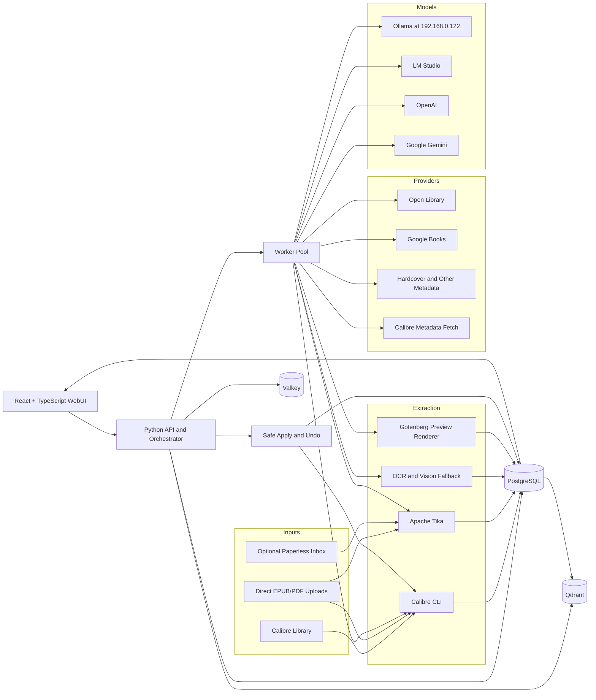

# Architecture

This project is evolving from a basic CLI auditor into a safer, more scalable, evidence-first metadata review system. The design draws heavy inspiration from proven patterns in the open-source ecosystem.

## Open-Source Inspirations

*   **Calibre**: Provides the authoritative ebook metadata format (OPF), robust file-format operations, and cover extraction.
*   **Calibre-Web-Automated**: Inspirations for ingest watchers, provider hierarchy, duplicate handling, metadata enforcement, and automated backups.
*   **paperless-ngx**: Informs the ingest queue, document review workflow, robust API design, bulk actions, and administrative UX.
*   **paperless-gpt**: Provides patterns for multi-provider LLM orchestration, OCR fallbacks, background job processing, and manual review checkpoints.
*   **Apache Tika**: Adopted as an optional deterministic extraction sidecar for robust document parsing.
*   **Gotenberg**: Integrated as an optional preview renderer for generating review packets and visual confirmations.
*   **AnythingLLM**: Guides the design of a flexible provider registry and the UX for routing between local and remote models.
*   **Qdrant**: Integrated. Used for vector embedding storage and similarity search to enable semantic duplicate detection.
*   **PostgreSQL**: Serves as the primary system-of-record for robust, transactional data storage.
*   **Valkey**: Integrated. Handles job queues, distributed task states, and rate-limit caching.
*   **Komf / Komga / Kavita**: Inspirations for metadata matching logic, reader interfaces, and library review patterns.
*   **Bookshelf / rreading-glasses**: Provide models for handling optional discovery metadata separately from the core truth model.

> **Note**: `Readarr` is considered retired/archived in the context of this project and serves only as historical inspiration. `paperless-ai` is similarly viewed purely as a source of workflow ideas, not a direct dependency. `Calibre-Web-Automated` and `paperless-gpt` represent the most valuable and direct workflow inspirations.

## Core Flow

## Guiding Principles

1.  **Safety First**: By default, libraries are mounted read-only.
2.  **Evidence-First**: The book itself (the file content) is the primary source of truth.
3.  **Deterministic Extraction First**: We rely on hard evidence before guessing.
4.  **Model Reasoning Second**: LLMs evaluate the evidence; they do not dictate the truth independently.
5.  **Human Review Third**: Risky operations and uncertain metadata require manual confirmation.
6.  **Safe Write Last**: Write operations are transaction-like, involving strict backup procedures before execution.
