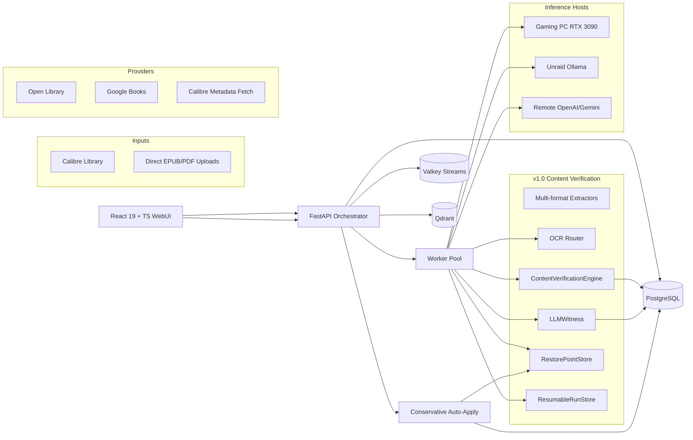

# Architecture

`calibre-ai-auditor` v1.0 is a content-ground metadata verification system.
The book file is the ground truth, deterministic rules adjudicate per
field, and an LLM is called as a witness only when the rules return
`ambiguous`.

This document is the canonical overview. Detailed component breakdowns
live in `docs/architecture/`.

## Open-Source Inspirations

| Project | Inspiration |
|---|---|
| **Calibre** | Authoritative ebook metadata format (OPF), file-format operations, cover extraction |
| **Calibre-Web-Automated** | Ingest watchers, provider hierarchy, duplicate handling, automated backups |
| **paperless-ngx** | Ingest queue, document review workflow, API design, bulk actions, admin UX |
| **paperless-gpt** | Multi-provider LLM orchestration, OCR fallbacks, background jobs, manual review checkpoints |
| **Apache Tika** | Optional deterministic extraction sidecar for robust document parsing |
| **Qdrant** | Vector embedding storage for semantic duplicate detection |
| **PostgreSQL** | Production transactional system-of-record |
| **Valkey** | Job queues, distributed task state, rate-limit caching |
| **Komf / Komga / Kavita** | Metadata matching logic, reader interfaces, library review patterns |
| **book-memex** | URI-addressable book records, FTS5 search, MCP-style agent integration patterns |

`Readarr` is considered retired; `paperless-ai` is a workflow-idea source
only. `paperless-gpt` is the most direct workflow inspiration.

---

## Core Flow (v1.0)

---

## v1.0 Components

### ContentVerificationEngine (new in v1.0)

The core adjudicator. For each book:

1. **Extract** — pull text snippets from EPUB/PDF, including title page,
   copyright page, ISBN block, header running text
2. **Project** — build `DeclaredMetadata` (what Calibre says) and
   `ObservationSet` (what we observed) from the DB + extracted content
3. **Probe** — run 8 deterministic rules per field:
   - `verify_title` — fuzzy match + edition-tag awareness
   - `verify_authors` — set comparison + transliteration (Cyrillic ↔ Latin)
   - `verify_isbn` — checksum-validated exact match
   - `verify_publisher` — variant-tolerant (e.g. "Penguin" vs "Penguin Books")
   - `verify_published_date` — ±1 day / year-only tolerance
   - `verify_language` — 3-letter ISO match
   - `verify_series` — presence/absence match
   - `verify_series_index` — float comparison
4. **Witness** — only fields that return `ambiguous` get sent to the LLM
5. **Verdict** — per-field `confirmed` / `mismatch` / `missing` / `ambiguous`
   with cited `EvidenceSpan`s
6. **Apply gate** — `auto_apply_eligible` iff (every field has deterministic
   verdict) AND (overall_confidence ≥ 80) AND (no high-risk flag) AND
   (per-field confidence ≥ 75)

### LLMWitness (new in v1.0)

Calls an LLM to adjudicate ambiguous fields only. Caches every response
by prompt-hash so the second book with the same ambiguity costs nothing.
Never downgrades a risk flag set by the deterministic engine.

- Cache hit: ~107µs
- Cache miss: ~1s on real LLM
- Privacy filters inherited from `LLMRouter` (`allow_remote_text`,
  `allow_remote_images`, `max_remote_chars`)

### OCRRouter (new in v1.0)

Per-page routing between OCR backends:
- Tesseract — default, always available, fast on clean text
- PaddleOCR — better on clean scans + CJK, GPU or CPU (optional `[ocr]` extra)
- Surya — best on noisy scans / multilingual / handwriting (optional `[ocr]` extra)

Routing decision per page based on a page-type classifier (`clean_scan` /
`noisy_scan` / `multilingual` / `table_heavy`).

### HostRegistry (new in v1.0)

Discovers and tracks homelab inference hosts (Ollama, LM Studio). Each
host has a `GPUClass` (`high` / `medium` / `low` / `cpu`). Tasks route by
GPU class: heavy vision → 3090, bulk OCR → medium GPU, embedding → medium GPU.

### RestorePointStore (new in v1.0)

Per-book restore points at `<artifacts_dir>/restore/<run_id>/<book_key>/`:
- Original OPF (calibredb export)
- Original cover image (if it was modified)
- Hardlink to the original file (instant; falls back to copy if FS doesn't
  support hardlinks)
- `before.json` and `after.json` snapshots
- `restore.json` metadata for bulk undo by run_id

7-day TTL cleanup; configurable.

### ResumableRunStore (new in v1.0)

Per-book state on Valkey Streams (or in-memory fallback). Worker crash
mid-run rolls `in_progress` books back to `pending`. Handles 50k books in
~8ms.

### MultiProvider Router (LLMRouter)

Routes LLM calls by GPU class to the best homelab host. Privacy filters
redact remote-bound content by default. Supports OpenAI, Gemini, Ollama,
LM Studio.

### Storage & Persistence

- **System-of-record**: PostgreSQL (production) or SQLite (dev/single-user)
- **Job queue + rate-limit cache**: Valkey (Redis-compatible)
- **Vector embeddings**: Qdrant (semantic duplicates)
- **Cover image cache**: local filesystem (`<artifacts_dir>/covers/`)
- **Restore points**: local filesystem (`<artifacts_dir>/restore/`)

### WebUI (React 19 + Vite + TanStack Query)

7 pages:

| Page | Purpose |
|---|---|
| **Dashboard** | System status, homelab host discovery, aggregated v1.0 verdict counters |
| **Verify (v1.0)** | Start a verify run, watch live progress, drill into per-book verdicts |
| **Scan Library** | Legacy v0.9 scan path |
| **Inspect File** | Single-file inspection |
| **Duplicates** | Semantic duplicates from Qdrant |
| **Review Queue** | Per-field verdict rendering for books needing human review |
| **Changes & Undo** | v1.0 restore points + API-queued run revert |

---

## Data Flow: a v1.0 verify run

1. User clicks "Run v1.0 Verify" in WebUI (or runs `bookaudit verify`)
2. `POST /api/verify` (or CLI command) creates a `VerifyRun` with
   `run_id = "verify_<timestamp>"`
3. Backend enqueues a task to a background worker
4. Worker iterates over BookRecords in the configured library
5. Per book:
   - Extract text from the first available format via `extract_snippets`
   - Run heuristics to extract title/authors/ISBN candidates
   - Build `DeclaredMetadata` from DB state + `ObservationSet` from extraction
   - Call `ContentVerificationEngine.verify()` → per-field verdicts
   - If `--use-llm`, call `LLMWitness.witness_field()` for ambiguous fields
   - Persist `BookVerdict` to `EvidencePackage.decision`
   - Update `BookRecord.status` to the verdict's action
6. Worker calls `metrics.record_book_action(action, run_id)`
7. On completion, the run appears in the WebUI's "Recent verify runs" list
8. User clicks the run → `/api/verify/{run_id}` returns full verdicts
9. If auto-apply enabled, `bookaudit apply --safe-only` iterates over
   `auto_apply_eligible: true` books, creates restore points, and patches
   Calibre via `calibredb set_metadata`

---

## Design Principles

1. **The book is the ground truth.** Content extraction always runs first;
   LLMs only adjudicate, never replace.
2. **Deterministic before generative.** 8 deterministic rules cover ~95% of
   fields correctly. LLMs handle the remaining ~5% ambiguities.
3. **Never downgrade a risk flag.** Once the deterministic engine sets
   `author_swap` / `isbn_conflict` / etc., the LLM witness cannot remove
   it — it can only add more risk_flags.
4. **Every apply creates a restore point.** No metadata write happens
   without `<artifacts_dir>/restore/<run_id>/<book_key>/` populated.
5. **Read-only by default.** `BOOKAUDIT_READ_ONLY=true` blocks all writes
   even if the engine produces auto-apply verdicts.
6. **Privacy by default.** Remote LLMs receive redacted content unless
   explicitly enabled. Local models are always used by default.
7. **Fail-safe, not fail-fast.** A failed LLM call is a `needs_review`,
   not a crash. A failed OCR is a fallback path, not an error.

---

## Detailed Architecture Docs

- **[docs/architecture/target-advanced-architecture.md](docs/architecture/target-advanced-architecture.md)** — Full component diagram + performance characteristics
- **[docs/architecture/integration-decisions.md](docs/architecture/integration-decisions.md)** — Architecture Decision Records
- **[docs/architecture/v1_scope_decisions.md](docs/architecture/v1_scope_decisions.md)** — What's in / out of v1.0 (comics, audiobooks, MCP)
- **[docs/research/PEER_PROJECTS.md](docs/research/PEER_PROJECTS.md)** — Comparison vs `paperless-gpt`, `book-memex`, etc.
