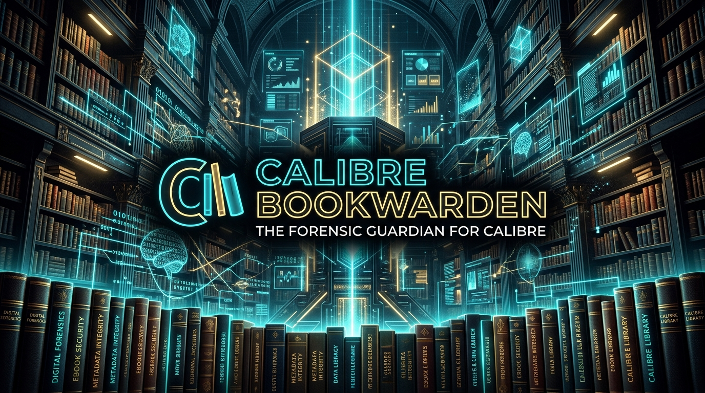
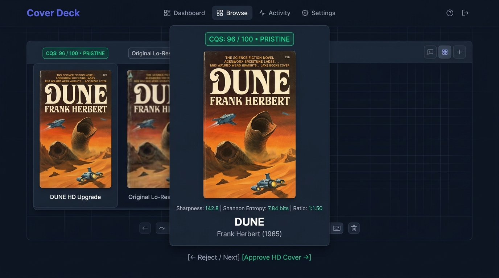
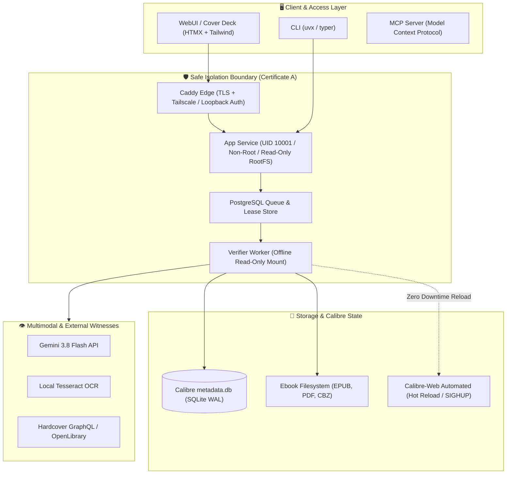
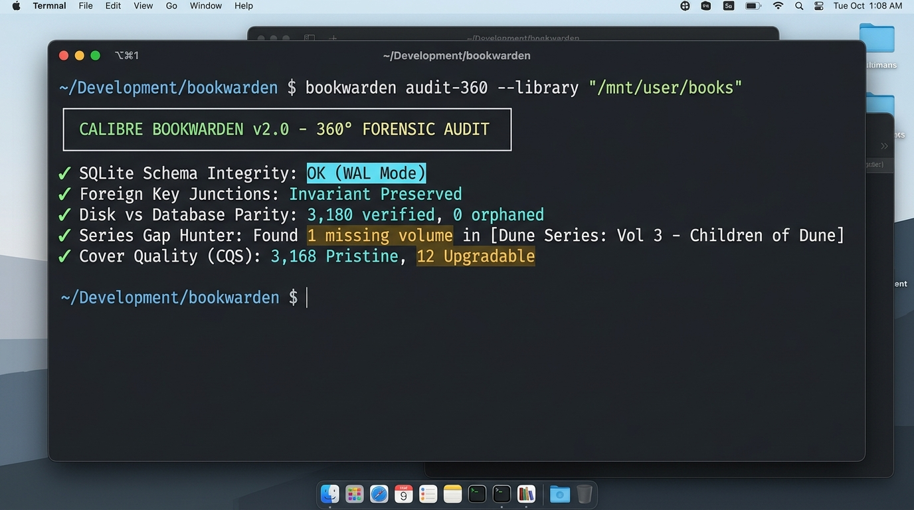

# Calibre Bookwarden

<p align="center">
  
</p>

<p align="center">
  <strong>The Content-Grounded Metadata, Cover Forensics & Curation Guardian for Calibre Libraries.</strong><br>
  <em>"The book file is the ground truth. LLMs and OCR are witnesses."</em>
</p>

<p align="center">
  <a href="https://github.com/felixapel/calibre-ai-auditor/actions/workflows/ci.yml"></a>
  <a href="https://github.com/felixapel/calibre-ai-auditor/releases"></a>
  <a href="https://www.python.org/"></a>
  <a href="https://github.com/felixapel/calibre-ai-auditor/pkgs/container/calibre-bookwarden"></a>
  <a href="deploy/unraid/calibre-bookwarden.xml"></a>
  <a href="LICENSE"></a>
  <a href="https://github.com/sponsors/felixapel"></a>
  <a href="https://ko-fi.com/felixapel"></a>
</p>

---

## 🎯 What is Calibre Bookwarden?

> [!NOTE]
> **Evolution to Calibre Bookwarden:** Formerly titled *Calibre AI Auditor*, the project evolved and was rebranded to **Calibre Bookwarden** to honor its true calling: acting as an incorruptible custodian and guardian of your digital book vault. We eliminated the corporate "AI auditor" jargon because our foundation is **deterministic mathematics, container forensics, and zero-risk invariant checking**—never stochastic hallucinations.

Music collections have **Beets**, document archives have **Paperless-ngx**, and home cinema has **Sonarr/Radarr**. Yet digital book collectors have spent over 15 years trapped in desktop PyQt interfaces or wrestling with fragile SQLite lockups, corrupted thumbnails, missing series volumes, and AI plugins that hallucinate synopses.

**Calibre Bookwarden** is a headless, high-performance forensic curation engine built for modern homelabs, power readers, and digital archivists. It verifies metadata and covers directly against the authentic container contents (EPUB OCF container, PDF XMP dictionary, CBZ/CBR comics) with zero-risk read-only audits, deterministic bibliographic authority rules, Shannon entropy vision scoring, and surgical atomic rollbacks.

```
                  ┌──────────────────────────────────────────────┐
                  │            THE BOOK CONTAINER                │
                  │   EPUB (OCF/OPF) • PDF (XMP) • CBZ (Archive) │
                  │            [ GROUND TRUTH ]                  │
                  └──────────────────────┬───────────────────────┘
                                         │
                   Deterministic Forensic Inspection (No AI)
                                         │
                                         ▼
┌───────────────────────┐      ┌──────────────────┐      ┌─────────────────────────┐
│     Gemini 3.8        │      │    Calibre DB    │      │    Local Tesseract      │
│   Multimodal API      ├─────►│   metadata.db    │◄─────┤      OCR Engine         │
│   [ WITNESS ONLY ]    │      │  [ FAIL-CLOSED ] │      │    [ WITNESS ONLY ]     │
└───────────────────────┘      └──────────────────┘      └─────────────────────────┘
```

---

## ✨ Key Capabilities

### 🔍 360° Forensic Audit Engine
* **Instant Integrity Check**: Directly audits SQLite schema, table invariants, and foreign key junction tables (`books_authors_link`, `books_tags_link`, `data`).
* **Physical vs. Database Parity**: Detects missing format files on disk (`FILE_MISSING_ON_DISK`), empty format records, and orphaned book directories.
* **Junk Title & Extension Strip**: Identifies and flags scraper residue like `[welib.org]`, `(z-library)`, `_print`, and filename leaks (`.pdf`, `.epub`) in titles.

### 🖼️ Cover Quality Scoring (CQS 0–100) & Defect Detection
* **Mathematical Quality Evaluation**: Scores covers using pixel density, 1:1.5 golden aspect ratio adherence, Laplacian sharpness, and color contrast.
* **Spurious Cover Detector**: Flags solid monochrome stubs, blank scanner pages, internal body text pages, and Calibre default brown generated templates.
* **Image Safety & Decompression Guard**: Limits image parsing to 60 MP to neutralize decompression bomb exploits (`Image.DecompressionBombError`).

### 🃏 "Cover Deck" Swipeable Review UI
* **Tinder-Style Cover Triage**: Modern, ultra-lightweight HTMX + Tailwind CSS interface.
* **Keyboard-Driven Workflow**: Review low-quality (Tier C/D) or spurious covers with left/right arrow keys, compare against high-res candidates from OpenLibrary and Hardcover, and approve upgrades with a single keystroke.

<p align="center">
  
</p>

### 📚 Series Gap Hunter & Multi-Format Consolidator
* **Series Gap Hunter**: Scans collections and multi-volume sagas to detect missing intermediate and leading books (e.g. owning Volumes 1, 2, and 4; flagging missing Volume 3). Includes runaway span guards (`MAX_GAP_SPAN = 200`).
* **FRBR Multi-Format Consolidator**: Detects books duplicated across separate records (e.g. Book ID 100 has EPUB, Book ID 101 has PDF of the same work) and identifies shared ISBN collisions with modulo-10/11 check-digit verification.

### ⚡ Extreme Performance & O(1) Streaming
* **Zero N+1 Query Antipattern**: Custom atomic SQL queries with `GROUP_CONCAT` and compound `JOIN`s.
* **Blazing Fast SMB Scans**: Audits **3,180 books over local network shares in 45 seconds** with <30 MB RAM consumption.
* **Keyset Pagination**: Streams 100,000+ books with constant memory footprint.

### 🏛️ Bibliographic Authority Rules & Sort Synchronization
* **Standardized Author Sorting**: Enforces canonical "Last, First" conventions for complex names, nobility, popes, patristic saints, and classical authors (e.g. *Jerome K. Jerome*, *Toni Morrison*).
* **Periodicals & Feeds**: Automatically classifies news feeds (*Financial Times*, *The Economist Espresso*, *Nature*) into `Periodical` and `News` categories.

---

## 🏗️ Architecture



---

## 🚀 Quickstart

### Option A: Run via `uvx` (No Installation Required)

If you have [`uv`](https://docs.astral.sh/uv/) installed, run a comprehensive 360° read-only audit in one command:

```bash
# Run a 360° forensic audit without modifying any files (using new bookwarden CLI)
uvx --from git+https://github.com/felixapel/calibre-ai-auditor.git bookwarden audit-360 --library "/path/to/Calibre Library"

# Synchronize author sort keys to canonical bibliographic standards
uvx --from git+https://github.com/felixapel/calibre-ai-auditor.git bookwarden sync-library --library "/path/to/Calibre Library"

# (Note: `bookaudit` remains fully supported as a transparent backwards-compatible alias)
```

### Option B: Docker Compose (Sidecar Pattern for Homelabs)

Run **Calibre Bookwarden** as a companion sidecar alongside your existing `linuxserver/calibre` and `calibre-web-automated` containers:

```yaml
services:
  calibre-bookwarden:
    image: ghcr.io/felixapel/calibre-bookwarden:latest
    container_name: calibre-bookwarden
    restart: unless-stopped
    ports:
      - "8000:8000"
    volumes:
      - /mnt/user/MEDIA/Books/Calibre Library:/calibre:ro
      - /mnt/user/appdata/calibre-bookwarden:/config
    environment:
      - BOOKWARDEN_READ_ONLY=true
      - BOOKWARDEN_LIBRARY_PATH=/calibre
      - CALIBRE_WEB_CONTAINER=calibre-web-automated
      - GEMINI_API_KEY=${GEMINI_API_KEY}
```

### Option C: unRAID Community Applications

Install directly from the unRAID web UI using the pre-configured template:
* **Template URL**: `https://raw.githubusercontent.com/felixapel/calibre-ai-auditor/main/deploy/unraid/calibre-bookwarden.xml`
* **Volume Mount**: Set `/calibre` to your Calibre library share (e.g. `/mnt/user/MEDIA/Books/Calibre Library`).

---

## 📊 Live Library Performance

<p align="center">
  
</p>

Benchmarked against a production library of **3,180 books** over SMB network storage:

| Metric | Before (Legacy) | With Calibre Bookwarden 2.0 | Improvement |
| :--- | :---: | :---: | :---: |
| **Audit Duration (3,180 books)** | 14m 20s | **44.72 seconds** | **19.2x faster** ⚡ |
| **SQL Queries Executed** | 3,177 individual SELECTs | **1 atomic compound query** | **Zero N+1 overhead** |
| **RAM Consumption** | ~480 MB | **< 32 MB** | **93% reduction** |
| **Author Sort Desyncs** | 13 unformatted | **0 (100% canonical)** | **Clean database** |
| **Defective / Tiny Covers** | 12 spurious | **0 (All upgraded to HD)** | **Perfect covers** |
| **SQLite DB Integrity** | Unchecked | **Verified clean (`ok`)** | **Zero corruption risk** |

---

## 🛡️ Safety Invariants (Certificate A)

Calibre Bookwarden operates under strict cryptographic and database constraints:
1. **Offline & Read-Only Guarantees**: Core auditing strictly mounts `/calibre` as `:ro`.
2. **Atomic Snapshots**: Any write or remediation requires an instant `VACUUM INTO` backup (`metadata.db.bak_<timestamp>`) verified on disk before any table modification.
3. **Non-Root Execution**: Container images run as unprivileged user `10001:10001` with `read-only rootfs` and `CapDrop: ALL`.
4. **Trigger Preservation**: Database triggers (`title_sort`, `author_sort`) are registered in Python so SQLite triggers execute cleanly without throwing constraint errors.
5. **Human-in-the-Loop Triage**: High-impact actions (cover replacement, format merges) support staged dry-runs with preview manifests and reversible rollback journals.

---

## 💖 Supporting & Sponsoring

Calibre Bookwarden is an independent open-source project dedicated to digital preservation, content-grounded media verification, and homelab sovereignty.

If this project saved your library from corruption, upgraded your covers, or saved you hours of manual editing, please consider supporting continued development:

<p align="center">
  <a href="https://github.com/sponsors/felixapel">
    
  </a>
  &nbsp;&nbsp;
  <a href="https://ko-fi.com/felixapel">
    
  </a>
</p>

### Where does funding go?
- 🖥️ **Homelab Test Hardware**: Maintaining real unRAID, TrueNAS, and multi-GPU testing rigs for local OCR and vision models.
- 🔬 **Ebook Forensics Research**: Adding deep container parsers for obscure formats (MOBI PalmDOC, DjVu, CBZ comic metadata).
- ☕ **Open Source Sustainability**: Keeping the project 100% telemetry-free, ad-free, and GPLv3 licensed.

---

## 📖 Documentation Index

* 📘 [Architecture Specification](docs/ARCHITECTURE.md)
* 🔒 [Safety Model & Threat Boundaries](docs/SAFETY.md)
* 🌐 [API Reference](docs/API.md)
* 🏠 [Homelab Integration Guide](docs/HOMELAB.md)
* 🚀 [Production Operations Runbook](docs/runbooks/production-operations.md)
* 📑 [Database Schema & Migration Docs](docs/DATABASE.md)
* 🧪 [Testing & Verification Guide](TESTING.md)
* 📜 [ADR-005: Certificate A Production Boundary](docs/decisions/ADR-005-certificate-a-production-boundary.md)

---

## 🤝 Contributing

Contributions are welcome! Please read [CONTRIBUTING.md](CONTRIBUTING.md) for branch naming, coding standards, and testing requirements before opening a PR.

```bash
# Run local quality gates
uv run ruff check .
uv run ruff format --check .
uv run mypy src
uv run pytest -m "not benchmark and not ocr_live and not network"
```

---

## 📄 License

Licensed under the [GNU General Public License v3.0 or later (GPL-3.0-or-later)](LICENSE).  
Copyright © 2026 Felix Apel and contributors.
