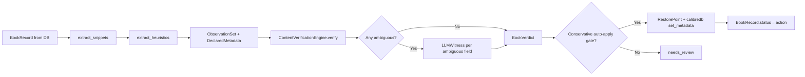
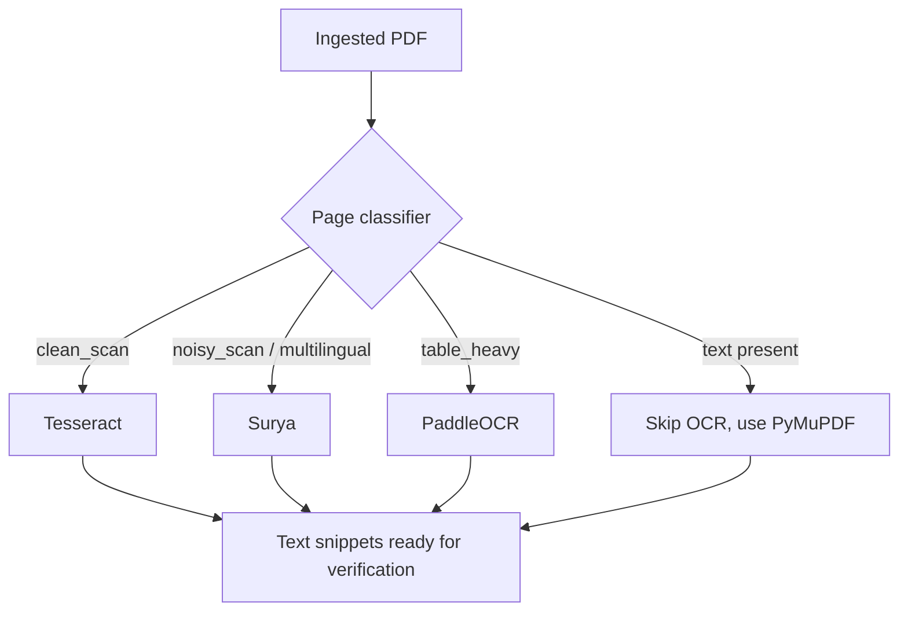

# Target Advanced Architecture (v1.0)

This document defines the production-grade target architecture for
`calibre-ai-auditor` v1.0. The canonical overview lives at the repo
root: [../../ARCHITECTURE.md](../../ARCHITECTURE.md).

---

## 1. Principles

1.  **The book is the ground truth.** Content extraction always runs first.
    LLMs only adjudicate, never replace.
2.  **Deterministic before generative.** 8 deterministic rules cover ~95% of
    fields correctly. The LLM witness handles the remaining ~5% ambiguities.
3.  **Safety & Non-Destructive Mutations.** Every apply creates a per-book
    restore point (OPF + cover + hardlinked file + JSON snapshot) with a
    7-day TTL. Bulk undo by run_id is supported.
4.  **Local-First Hybrid Inference.** Core processes default to local
    utilities (Ollama, native parsers, Tesseract). High-cost cloud APIs
    (OpenAI, Gemini) are used strictly as fallback models for complex
    ambiguity resolution.
5.  **Extensible Parsing Interfaces.** File formats and OCR / metadata
    providers are modeled as decoupled plugins, keeping boundaries clean.
6.  **Conservative Auto-Apply.** A book is auto-eligible only when every
    field has a deterministic verdict AND overall_confidence ≥ 80 AND no
    high-risk flag AND per-field confidence ≥ 75.

---

## 2. Components

```mermaid
flowchart TD
    CLI[bookaudit CLI]
    WebUI[React 19 + TS WebUI]
    App[FastAPI Orchestrator]
    Queue[Valkey Task Queue + ResumableRunStore]
    Worker[Worker Pool]

    %% v1.0 core
    VER[ContentVerificationEngine]
    WIT[LLMWitness]
    OCR[OCRRouter: Tesseract/PaddleOCR/Surya]
    RP[RestorePointStore]
    HOST[HostRegistry: 3090/5060 Ti/1660 SUPER]

    %% legacy still wired
    EXTRACT[Multi-format Extractors]
    TIKA[Tika Sidecar]
    PDF[PyMuPDF4LLM]
    VEC[Qdrant Vector Search]

    %% providers
    PROV[Provider Adapters]
    OL[OpenLibrary]
    GB[Google Books]
    CAL[Calibre CLI/API]

    %% infra
    DB[(PostgreSQL/SQLite)]
    VK[(Valkey)]
    QD[(Qdrant)]
    PROM[/metrics Prometheus]

    CLI --> App
    WebUI --> App
    App --> Queue
    Queue --> Worker
    Worker --> VER
    Worker --> OCR
    Worker --> WIT
    Worker --> EXTRACT
    Worker --> VEC
    Worker --> HOST
    VER --> DB
    WIT --> DB
    Worker --> PROV
    PROV --> OL
    PROV --> GB
    PROV --> CAL
    Worker --> RP
    EXTRACT --> TIKA
    EXTRACT --> PDF
    App --> PROM
```

---

## 3. v1.0 Book Processing Lifecycle

1.  **Discovered**: A book is in the Calibre library DB; v1.0 reads `current_metadata`
    via `calibredb list --for-machine`.
2.  **Extracting**: Multi-format extractors pull text from the first available
    format (EPUB / PDF / CBZ). Cover image extracted via PyMuPDF or
    `calibredb` export.
3.  **Building observation**: `extract_heuristics()` parses title page,
    copyright page, ISBN block. Result becomes `ObservationSet`.
4.  **Deterministic Probing**: `ContentVerificationEngine` runs 8 rules per
    field. Each produces a `FieldVerdict` with cited `EvidenceSpan`.
5.  **LLM Witnessing**: Only fields returning `ambiguous` are sent to the
    LLM witness. Privacy filters redact remote-bound content unless
    explicitly enabled.
6.  **Verdict Aggregation**: per-field verdicts → `BookVerdict` with action
    (`no_change` / `suggest_fix` / `needs_review` / `defer`) and
    `auto_apply_eligible` flag.
7.  **Review & Apply**:
    - `no_change` → no action
    - `suggest_fix` + `auto_apply_eligible: true` → safe to apply via
      `bookaudit apply --safe-only`
    - `needs_review` → human approval required
    - `defer` → insufficient signal; needs LLM witness or more context
8.  **Restoration**: every apply writes a `RestorePointStore` entry
    (OPF + cover + hardlinked file + JSON).

---

## 4. v1.0 Content Verification Pipeline



---

## 5. Per-Field Verdict Schema

```python
class FieldVerdict(BaseModel):
    field: str                    # title, authors, isbn, publisher, date, language, series, series_index
    declared_value: Any
    observed_value: Any | None
    verdict: VerdictKind          # confirmed | mismatch | missing | ambiguous
    confidence: int              # 0-100
    evidence: list[EvidenceSpan] # cited source snippets
    risk_flags: list[str]         # author_swap, isbn_conflict, etc.
    reason: str | None
    is_deterministic: bool
```

```python
class BookVerdict(BaseModel):
    book_key: str
    field_verdicts: dict[str, FieldVerdict]
    overall_confidence: int
    risk_flags: list[str]
    action: VerdictAction          # no_change | suggest_fix | needs_review | defer
    auto_apply_eligible: bool
    proposed_patch: dict[str, Any]
    reasons: list[str]
```

---

## 6. Model Routing

Per-task capability-based routing via `LLMRouter` + `HostRegistry`:

| Task | Default | Fallback |
|---|---|---|
| Fast utility (title normalization, etc.) | Local Ollama (`qwen3:8b`) | Remote OpenAI (`gpt-4o-mini`) |
| Deep reasoning / v1.0 witness | Local Ollama (`qwen3:8b`) | Gemini 2.5 Pro |
| Vision (cover, title page) | Local Ollama vision model | `gpt-4o-mini` vision |
| Embedding (semantic dedup) | Local `nomic-embed-text` | `text-embedding-3-small` |

Privacy filters apply: `allow_remote_text: false` (default) and
`allow_remote_images: false` block remote content by default.

---

## 7. Multi-Host Inference (v1.0)

`HostRegistry` discovers Ollama + LM Studio hosts. Each host has a
`GPUClass` (`high` / `medium` / `low` / `cpu`).

Tasks route by GPU class:
- `heavy_vision` → `high` GPU (e.g. RTX 3090)
- `bulk_ocr` → `medium` GPU (e.g. RTX 5060 Ti)
- `embedding` → `medium` GPU

Configured homelab hosts:
- `192.168.0.89` — RTX 3090, LM Studio (high)
- `192.168.0.122` — Unraid Ollama (medium, RTX 5060 Ti + 1660 SUPER)
- `localhost:11434` — fallback (low/cpu)

Discover via `bookaudit hosts`.

---

## 8. OCR Pipeline (v1.0)



Routing decision per page based on a per-page classifier hint. Tesseract is
always available; PaddleOCR + Surya require the `[ocr]` optional extra.

---

## 9. Conservative Auto-Apply Gate (v1.0)

```
AUTO_APPLY_MIN_CONFIDENCE: int = 80
AUTO_APPLY_MIN_FIELD_CONFIDENCE: int = 75

HIGH_RISK_FLAGS = {
    "author_swap", "isbn_conflict", "edition_ambiguous",
    "cover_mismatch", "wrong_book", "series_mismatch",
    "publisher_mismatch"
}
```

A book is auto-apply eligible iff:
1. Every declared field has a deterministic verdict (no `ambiguous`)
2. `overall_confidence ≥ AUTO_APPLY_MIN_CONFIDENCE`
3. No `HIGH_RISK_FLAGS` present
4. Every per-field confidence ≥ `AUTO_APPLY_MIN_FIELD_CONFIDENCE`
5. No field has `requires_review: true`

---

## 10. Restore Points (v1.0)

Every apply creates:
```
.artifacts/restore/<run_id>/<book_key>/
├── original.opf                 # calibredb export of pre-apply metadata
├── original.<ext>               # hardlink to the original book file
├── original.cover.<ext>          # original cover (if changed)
├── before.json                   # full metadata snapshot
├── after.json                    # full metadata snapshot
└── restore.json                  # {run_id, book_key, applied_at, fields_changed}
```

TTL: 7 days (configurable). Bulk undo by `run_id` walks every entry.

---

## 11. Resumable Runs (v1.0)

`ResumableRunStore` writes per-book state to Valkey Streams. On worker
crash, the next worker rolls `in_progress` books back to `pending` and
re-runs them. Handles 50k books in ~8ms.

```
run:<run_id>:books  (Valkey Stream entry per state transition)
  XADD * book_key "calibre:42" status "in_progress" ts "..."
```

---

## 12. LLM Witness Caching (v1.0)

Every LLM call is hashed on its rendered prompt. Same prompt + same schema
→ same response, served from `WitnessCache` in 107µs vs ~1s for a real
LLM call. **Cache hit ratio is the single most important metric for
v1.0 cost control** — surfaced via `/api/metrics`.

---

## 13. Document Conversion

For non-ebook formats (DOCX, RTF, HTML):
- **Stateless Gotenberg Container**: `docker compose` includes
  `gotenberg:8` on port 3000.
- **Output PDF**: worker posts the file to
  `/forms/libreoffice/convert`, receives a clean PDF, feeds it into the
  PyMuPDF4LLM extraction path.

---

## 14. Queue and Worker Design

- **Task Broker**: Valkey (Redis-compatible).
- **Worker Pool**: Async `web/jobs.py` worker pool driven by Valkey.
- **Locking**: distributed mutex via `valkey.set(lock_key, token, nx=True, ex=300)`.

---

## 15. Cache Design

Two-tier:
1. **RAM Cache**: process-level dictionary for local CLI runs.
2. **Valkey Cache**: shared across API + workers. Provider requests cached
   24h; LLM responses cached matching prompt-hash.

---

## 16. Storage Model

- `metadata.db` (SQLite by default; PostgreSQL in production):
  - `runs`, `book_records`, `evidence_packages`, `changes`
- `.artifacts/`:
  - `covers/<book_key>.jpg`
  - `restore/<run_id>/<book_key>/...` (per-book restore points)
  - `metrics/baseline.json` (CI benchmark baseline)
- `.benchmarks/` (CI baseline artifacts)

---

## 17. Calibre Integration

Hybrid model:
- **Read-Only**: subprocess `calibredb list --for-machine --fields all` for
  speed + safety.
- **Write-Back**: official `calibredb set_metadata` to keep Calibre's
  internal events and index files synchronized. v1.0 restore point is
  written FIRST via `calibredb export_metadata`.

---

## 18. v1.0 Human Review Workflow

- `needs_review` books land in the WebUI Review Queue with per-field
  verdict chips (Confirmed / Mismatch / Missing / Ambiguous) and
  evidence spans.
- Author approves or rejects per-book via `POST /api/review/{key}/approve|reject`.
- High-risk books (`author_swap`, `isbn_conflict`, etc.) are never
  auto-applied — they always require human eyes.

---

## 19. Observability

- **Structured Logging**: JSON logs with `run_id`, `book_key`, `host`
  correlation IDs.
- **Progress Metrics**: per-job progress written to Valkey for the React
  frontend to poll.
- **Prometheus `/metrics`**: counters (LLM calls, OCR pages, book actions),
  gauges (queue depth, host health), histograms (LLM latency, render time).

---

## 20. Privacy and Security

- `allow_remote_text: false` (default) — no snippets to remote LLMs.
- `allow_remote_images: false` (default) — no cover images to remote vision.
- `BOOKAUDIT_API_KEY` (optional) — middleware enforces `X-API-Key` header.
- `BOOKAUDIT_READ_ONLY: true` (default) — blocks all writes.

---

## 21. Failure Handling

- **Model Failover**: `LLMRouter` retries with next provider if primary
  fails; `WitnessCache` serves the response if it's been seen before.
- **Restore Points**: every apply writes restore point first; undo is
  unconditional and restore-point-aware.
- **Resume**: worker crash → `in_progress` rolled back to `pending`.
- **Graceful Degradation**: failed OCR → `ambiguous` field → LLM witness
  → human review. Nothing crashes.

---

## 22. Deployment Modes

- **Development / CLI**: SQLite + in-memory cache. `pip install -e .`
  + Calibre CLI on `$PATH`.
- **Homelab (Docker Compose)**: full stack — Postgres + Valkey + Qdrant +
  Tika + Gotenberg + FastAPI + WebUI.
- **Production (single host)**: scale up Postgres + Valkey, run FastAPI
  with `--workers 4`, put nginx in front for TLS.

---

## 23. Open Questions

1. **Calibre library lock conflicts**: how do we handle if the Calibre
   desktop GUI is open during an audit write? Current: rely on
   `calibredb set_metadata`'s own file locking. Mitigation: `--wait-for-calibre-lock`
   flag (planned for v1.0.1).
2. **MCP server**: expose audit tools to Hermes agent (planned for v1.2).
3. **Comics vision**: cover identification via vision LLM (planned for v1.1).
