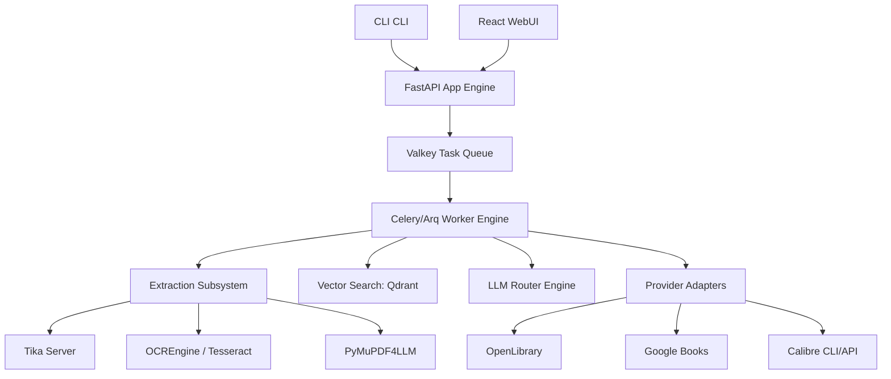
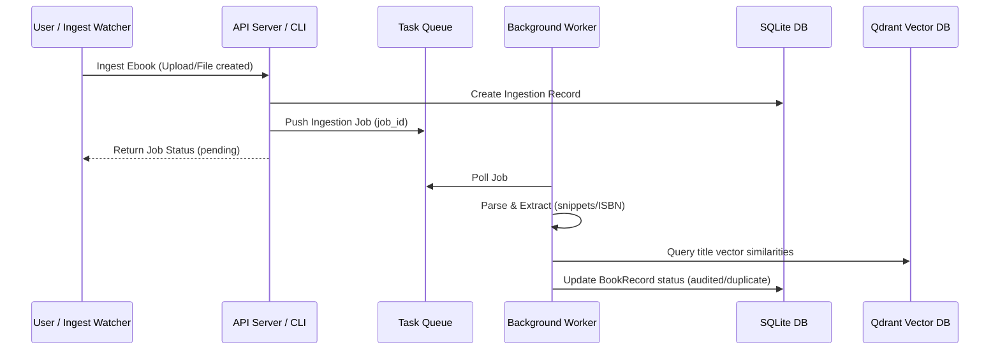
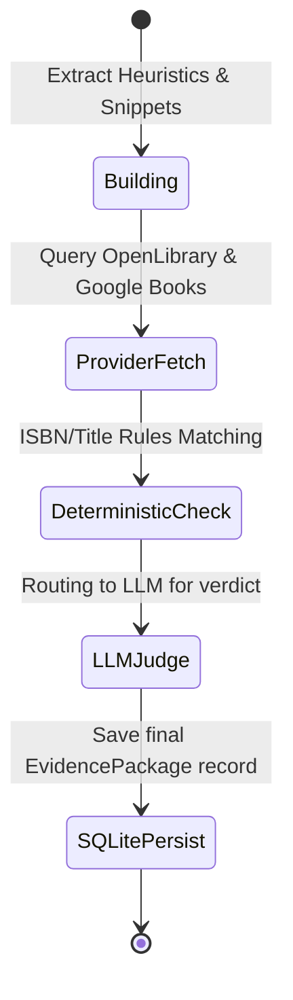
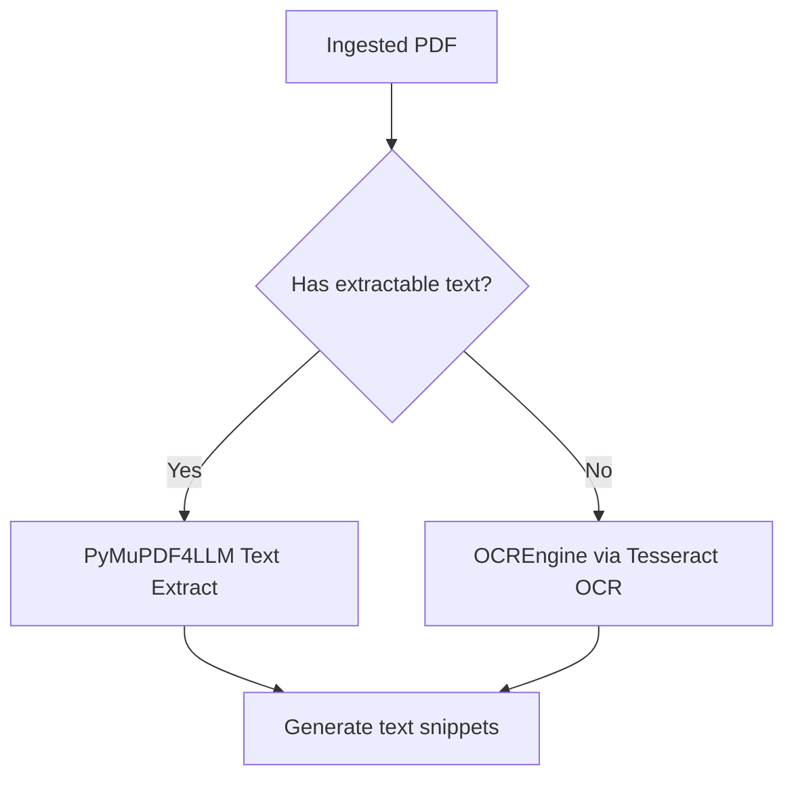
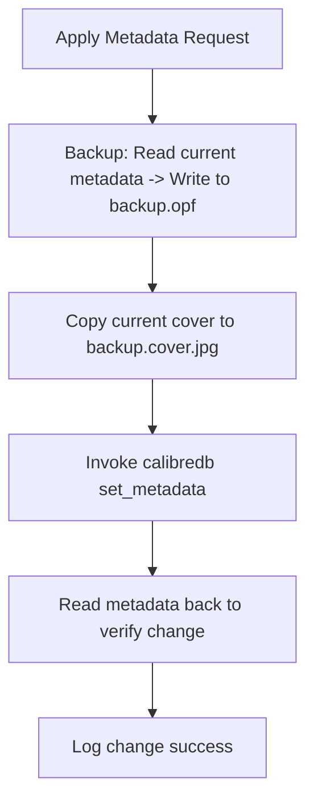

# Target Advanced Architecture

This document defines the production-grade target architecture for `calibre-ai-auditor`.

---

## 1. Principles

1.  **Evidence-Based Decisions**: The system collects evidence deterministically. Large Language Models (LLMs) act strictly as judges evaluating the gathered evidence; they never directly rewrite or invent book records.
2.  **Safety & Non-Destructive Mutations**: Any change made to a book's metadata must be backed up (storing the original file metadata and cover) with a simple single-command undo path.
3.  **Local-First Hybrid Inference**: Core processes default to local utilities (Tesseract, Ollama, native parsers). High-cost cloud APIs (OpenAI, Gemini) are used strictly as fallback models for complex ambiguity resolution.
4.  **Extensible Parsing Interfaces**: File formats and metadata provider backends are modeled as decoupled plugins, keeping boundaries clean.

---

## 2. Components



---

## 3. Main Data Flow



---

## 4. Book Processing Lifecycle

1.  **Discovered**: The file watcher or scanner identifies an EPUB/PDF file and creates a database record.
2.  **Extracting**: The system parses the file format to retrieve basic metadata (ISBN, title, author) and first pages text.
3.  **Enriching**: Parallel network queries fetch work candidates from Open Library, Google Books, and Calibre.
4.  **Judging**: The LLM router requests structured verdicts matching the candidate metadata schema.
5.  **Status Assignment**:
    *   `safe`: Confidence exceeds 95% threshold; matches deterministic identifiers.
    *   `needs_review`: Lower confidence or key discrepancies (e.g. author name swap).
    *   `duplicate`: Duplicate detected via Qdrant title embeddings.

---

## 5. Evidence Package Lifecycle



---

## 6. Model Routing

We map LLM requests to specific models dynamically based on the complexity and security requirements of the task:

*   **Fast Utility Task**: Normalization of titles and author strings is routed to local Ollama instances running lightweight models (`qwen3:8b`).
*   **Deep Reasoning / Judge Task**: High-ambiguity audit judgments are routed to `gpt-5.5` or `gemini-2.5-pro` structured outputs.
*   **Vision Task**: Evaluating cover image similarities is routed to vision-capable models (`gpt-5.4-mini` or local `qwen2.5vl:7b`).
*   **Embedding Task**: Vector generation is routed to local `nomic-embed-text` or cloud `text-embedding-3-small`.

---

## 7. Document Conversion

We provide clean sandboxing for document conversions to prevent untrusted files from compromising the container:
*   **Stateless Gotenberg Container**: If a non-ebook format (e.g. `DOCX`, `RTF`, `HTML`) is ingested, the worker posts it to Gotenberg's `/forms/libreoffice/convert` API.
*   **Output PDF**: The worker receives the clean output PDF and feeds it into the normal parsing pipeline (PyMuPDF4LLM).

---

## 8. OCR and Text Extraction



---

## 9. Metadata Providers

All provider requests inherit from a base `BaseProvider` class, exposing:
*   `fetch_candidates(title, authors, isbn) -> list[Candidate]`
*   **Concurrency**: Every request is fired concurrently via `asyncio.gather` with a strict `timeout` parameter to avoid hanging threads.
*   **Rate Limits & Cooldowns**: If a provider returns a `429 Too Many Requests` response, a Valkey cooldown lock is set to skip that provider for 10 minutes.

---

## 10. Vector Search and Duplicate Detection

*   **Embeddings**: We compute 384-dimensional dense vectors using local `nomic-embed-text`.
*   **Storage**: Collections are stored in Qdrant with title and author payloads.
*   **Duplicate Detection Query**:
    ```python
    qdrant_client.query_points(
        collection_name="books",
        query_vector=book_title_vector,
        query_filter=Filter(must=[FieldCondition(key="language", match=MatchValue(value="en"))]),
        limit=5
    )
    ```
*   Similarity scores exceeding `0.85` trigger duplicate flags.

---

## 11. Queue and Worker Design

To handle long-running OCR and LLM calls without blocking HTTP endpoints, we employ an asynchronous worker model:
*   **Task Broker**: Valkey (Redis-compatible).
*   **Worker Pool**: Async Arq or Celery worker nodes.
*   **Locking**: Distributed mutex locks using `valkey.set(lock_key, token, nx=True, ex=300)` coordinate workers and prevent double-processing.

---

## 12. Cache Design

We utilize a two-tier caching strategy to limit network request latencies:
1.  **RAM Cache**: Simple process-level dictionary caching for local CLI runs.
2.  **Shared Valkey Cache**: Used by API servers and background workers.
    *   **Provider requests**: Cached with a 24-hour TTL.
    *   **LLM Responses**: Cached matching the hash of prompt instructions.

---

## 13. Storage Model

Relational state is persisted in **SQLite** (leveraging SQLModel/SQLAlchemy ORM), and heavy raw files are saved to the filesystem:
*   `metadata.db` contains: `runs`, `book_records`, `evidence_packages`, `changes`.
*   `.artifacts/` directory contains: original cover images, text snippets, and backup OPF files.

---

## 14. Calibre Integration

We support a hybrid integration model to balance execution speed with database safety:
*   **Read-Only Operations (Scans)**: Bypasses standard CLI subprocess latency by invoking `calibre-debug` with `calibre.library.db` directly to access cached records.
*   **Write-Back Operations (Applies)**: Invokes the official CLI `calibredb set_metadata` to update the library, ensuring Calibre's internal events and index files stay synchronized.

---

## 15. Safe Write-Back



---

## 16. Human Review Workflow

Suggestions containing high-risk flags (such as modifying the book's primary author, or changing an ISBN where conflicts exist) are never applied automatically:
*   They are placed in the `needs_review` list.
*   The user reviews the evidence package in the WebUI or CLI.
*   Applying the patch requires an explicit user approval event.

---

## 17. Observability

*   **Structure Logging**: JSON logs containing correlation IDs for jobs.
*   **Progress Metrics**: Tasks write percentage updates to the Valkey cache, allowing the React frontend to fetch real-time task progression.

---

## 18. Privacy and Security

*   **Remote Transmission Safeguards**: Full books are never sent to remote LLMs. Only small metadata segments and parsed text snippets (capped at 4,000 characters) are transmitted.
*   **Configuration Control**: Remote uploads must be explicitly enabled via `allow_remote_file_upload: true`.

---

## 19. Failure Handling

*   **Model Failover**: If the primary LLM provider fails, the router automatically retries the task with a fallback provider (e.g. failing from local Ollama to remote OpenAI).
*   **Transactional Rollbacks**: Any failure during backup or writing stages rolls back file swaps and reverts the database transaction.

---

## 20. Deployment Modes

*   **Development / CLI**: Light-weight, offline mode. Runs SQLite and in-memory caches locally without requiring Valkey or Qdrant containers.
*   **Production Stack**: Full Docker-compose architecture deploying the FastAPI API server, React frontend, Qdrant vector database, and Valkey queues.

---

## 21. Open Questions

1.  *How do we handle Calibre library lock conflicts if the desktop GUI is open during an audit write operation?*
2.  *Should we implement automatic database synchronization when the file watcher detects direct additions in Calibre's folder?*
